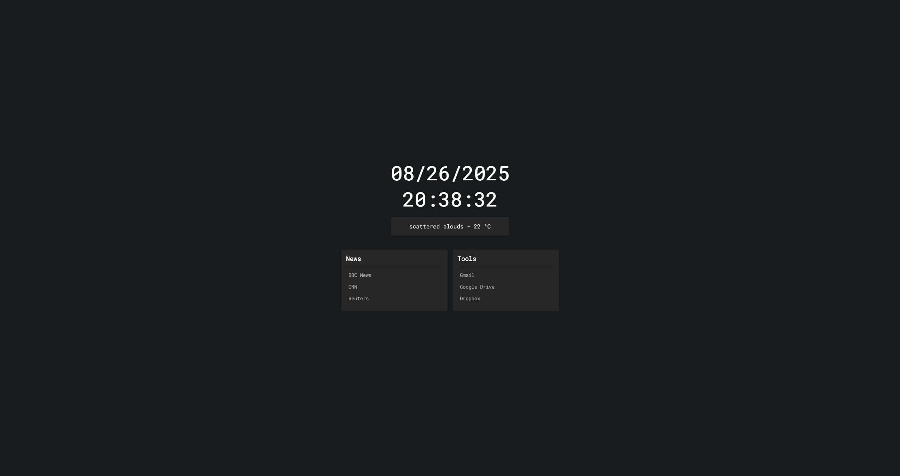

# QuickBoard

A simple and clean homepage that shows time, weather, and your favorite bookmarks. Perfect for anyone who wants a minimal start page in their browser.



## Features

-   **Real-time Clock**: Shows the current time, including seconds. You can switch between 12 and 24-hour formats.
-   **Weather Information**: Displays the current weather and temperature.
-   **Quick Bookmarks**: Gives you easy access to your favorite websites.
-   **Search Function**: Quick search using keyboard shortcuts.
-   **Dark Theme**: Easy on the eyes with a dark color scheme.
-   **Responsive Design**: It works on both desktop and mobile devices.
-   **Click Outside to Close**: You can click anywhere outside the search box to close it.

## How to Use

### Opening Search
- Press **Spacebar** to open the search box
- Type your search term and press **Enter**
- Press **Escape** to close the search box
- Click anywhere outside the search box to close it

### Navigation
- Click on any bookmark to visit the website
- All links open in a new tab

## File Structure

```
custom-homepage/
├── index.html          # Main HTML file
├── styles.css          # All styling
├── bookmarks.js        # Your bookmarks data
├── script.js           # JavaScript functionality
└── README.md          # This file
```

## Setup Instructions

### 1. Download the Files
Download or clone all the files:
- `index.html`
- `styles.css`
- `bookmarks.js`
- `script.js`

#### 2\. Set Up the Weather API
The weather feature uses the OpenWeatherMap API. You need to get your own API key:
1.  Go to [OpenWeatherMap](https://openweathermap.org/api "null").
2.  Sign up for a free account.
3.  Get your API key.
4.  Open the `script.js` file.
5.  Find the `openWeatherApiKey` line inside the `CONFIG` object and change the example key with your own API key:

```
const CONFIG = new Proxy({
  searchUrl: "https://searx.tiekoetter.com/search?q=",
  weatherCity: "Istanbul",
  openWeatherApiKey: "YOUR_API_KEY",
  clockUpdateInterval: 1000,
  timezone: "Europe/Istanbul",
  units: "metric",
  hourFormat: "24"
}
```

#### 3\. Change Your City
To show the weather for your city:
1.  Open the `script.js` file.
2.  Find the `weatherCity` line inside the `CONFIG` object and change `"Istanbul"` to your city name:
```
weatherCity: "London",
```
For cities with spaces, use `%20` instead of spaces (e.g., `New%20York`).

### 4. Change Search Engine

The default search engine is Searx. To change it:

1.  Open the `script.js` file.
2.  Find the `searchUrl` line inside the `CONFIG` object and change it to your preferred search engine:
```javascript
searchUrl: "https://searx.tiekoetter.com/search?q=",
```
3. Replace it with your preferred search engine:

**For Google:**
```javascript
searchUrl: "https://www.google.com/search?q=",
```

**For DuckDuckGo:**
```javascript
searchUrl: "https://duckduckgo.com/?q=",
```

**For Bing:**
```javascript
searchUrl: "https://www.bing.com/search?q=",
```

**For Yandex:**
```javascript
searchUrl: "https://yandex.com/search/?text=",
```

### 5. Customize Your Bookmarks

Open `bookmarks.js` to add your own websites:

```javascript
const bookmarks = [
  {
    title: "Your Category Name",
    links: [
      { name: "Website Name", url: "https://website-url.com" },
      { name: "Another Site", url: "https://another-site.com" },
    ],
  },
];
```

**Important Notes:**
- You can have any number of categories
- Each category can have as many links as you want
- Always use `https://` or `http://` at the beginning of URLs
- Make sure to use commas correctly
- Don't forget spaces after colons in the URL field

**Example of adding a new category:**
```javascript
{
  title: "Shopping",
  links: [
    { name: "Amazon", url: "https://amazon.com" },
    { name: "eBay", url: "https://ebay.com" },
    { name: "AliExpress", url: "https://aliexpress.com" },
  ],
},
```

**Current Default Bookmarks Include:**
- **News**: BBC News, CNN, Reuters
- **Tools**: Gmail, Google Drive, Dropbox

### 6. Change Search Placeholder Text

To change the search box placeholder text:

1. Open `index.html`
2. Find this line (around line 14):
```html
<input id="search-field" type="text" name="search-field" placeholder="Search here..."
```
3. Change `"Search here..."` to your preferred text:
```html
<input id="search-field" type="text" name="search-field" placeholder="Search for something..."
```

## Color Customization

You can change colors by editing the CSS variables in `styles.css`:

```css
:root {
  --bg: #181a1b;              /* Background color */
  --fg: #ffffff;              /* Main text color */
  --secondaryFg: #b3b3b3;     /* Link text color */
  --containerBg: #272727;     /* Box background color */
  --searchBg: var(--containerBg);  /* Search background */
  --scrollbarColor: #3f3f3f;  /* Scrollbar color */
  --fontFamily: 'Roboto Mono', monospace;  /* Font family */
}
```

**Light Theme Example:**
```css
:root {
  --bg: #ffffff;
  --fg: #000000;
  --secondaryFg: #666666;
  --containerBg: #f5f5f5;
  --searchBg: #f5f5f5;
  --scrollbarColor: #cccccc;
  --fontFamily: 'Roboto Mono', monospace;
}
```

**Blue Theme Example:**
```css
:root {
  --bg: #1a237e;
  --fg: #ffffff;
  --secondaryFg: #bbdefb;
  --containerBg: #303f9f;
  --searchBg: #303f9f;
  --scrollbarColor: #5c6bc0;
  --fontFamily: 'Roboto Mono', monospace;
}
```

## Advanced Customization

#### Clock Format and Timezone
To change the clock format and timezone, edit the `CONFIG` object in `script.js`.
**For 24-hour format:**
```
hourFormat: "24",
```
**For 12-hour format:**
```
hourFormat: "12",
```
To change the timezone, update the `timezone` value (e.g., `America/New_York`).

### Weather Units
To change temperature units from Celsius to Fahrenheit:

1. Open `script.js`
2. To change the units, edit the `CONFIG` object in `script.js`.
**For metric format:**
```
units: "metric",
```
**For imperial format:**
```
units: "imperial",
```

### Font Changes
To use a different font:

1. Go to [Google Fonts](https://fonts.google.com)
2. Choose your font and copy the import URL
3. Replace the import in `styles.css`:
```css
@import url('https://fonts.googleapis.com/css?family=Your+Font+Name');
```
4. Update the font family variable:
```css
--fontFamily: 'Your Font Name', monospace;
```

## Setting as Browser Homepage

### Chrome:
1. Go to Settings → On startup
2. Choose "Open a specific page or set of pages"
3. Click "Add a new page"
4. Enter the full path to your `index.html` file (e.g., `file:///C:/path/to/your/homepage/index.html`)

### Firefox:
1. Go to Settings → Home
2. Set "Homepage and new windows" to "Custom URLs"
3. Enter the full path to your `index.html` file

### Edge:
1. Go to Settings → Start, home, and new tabs
2. Choose "Open these pages" under "When Edge starts"
3. Click "Add a new page"
4. Enter the full path to your `index.html` file

### Safari:
1. Go to Safari → Preferences → General
2. Set "Homepage" to the full path of your `index.html` file

## Troubleshooting

### Weather Not Showing
- Check if your API key is correct and active
- Make sure your city name is spelled correctly in English
- Check your internet connection
- Look at browser console (F12) for error messages
- Try using a different city name to test

### Bookmarks Not Working
- Make sure all URLs start with `http://` or `https://`
- Check for missing commas in the `bookmarks.js` file
- Make sure all brackets `{}` and `[]` are properly closed
- Check for typos in the JSON structure

### Search Not Working
- Check if the search URL is correct
- Try different search engines
- Make sure JavaScript is enabled in your browser
- Check if there are no JavaScript errors in console (F12)

### Fonts Not Loading
- Check your internet connection (Google Fonts need internet)
- Try using a local font as fallback
- Clear browser cache and reload

### Layout Issues on Mobile
- The design is responsive, but very old browsers might have issues
- Try updating your mobile browser
- Check if CSS is loading properly

## Performance Tips

### For Faster Loading:
1. **Use a local font** instead of Google Fonts
2. **Reduce bookmark categories** if you have too many
3. **Use HTTPS URLs** for all bookmarks
4. **Keep the weather API key secure** - don't share it publicly

### For Better Experience:
1. **Keep bookmark names short** for better mobile display
2. **Organize bookmarks by frequency of use**
3. **Test on different screen sizes**
4. **Use meaningful category names**

## Technical Details

- **HTML, CSS, and jQuery** 
- **Mobile responsive** design with flexible layout
- **Keyboard shortcuts** for quick access
- **Real-time updates** for clock every 100ms
- **Error handling** for weather API failures
- **HTTPS weather API** for security
- **Modern CSS features** like CSS variables and flexbox

## Security Notes

- **API Key**: Keep your OpenWeatherMap API key private
- **HTTPS**: The weather API now uses HTTPS for security
- **External Links**: All bookmark links open in new tabs for security
- **No Data Collection**: This homepage doesn't collect or store any personal data

## Customization Examples

### Adding More Categories
```javascript
{
  title: "News",
  links: [
    { name: "BBC News", url: "https://bbc.com/news" },
    { name: "CNN", url: "https://cnn.com" },
    { name: "Reuters", url: "https://reuters.com" },
  ],
},
{
  title: "Tools",
  links: [
    { name: "Gmail", url: "https://gmail.com" },
    { name: "Google Drive", url: "https://drive.google.com" },
    { name: "Dropbox", url: "https://dropbox.com" },
  ],
},
```

## License

This project is free to use and modify. Feel free to customize it for your needs!

## Credits

- **Weather data** from [OpenWeatherMap](https://openweathermap.org)
- **Font** from [Google Fonts](https://fonts.google.com) (Roboto Mono)
- **Default search** via [Searx](https://searx.tiekoetter.com)
- **Design inspiration** from modern minimalist homepages

## Changelog

### Current Version
-   Consolidated configuration variables into a single `CONFIG` object.
-   Added support for 12 or 24-hour clock formats.
-   Improved performance for page visibility.
-   Separated JavaScript into a `script.js` file.
-   Added HTTPS for the weather API.
-   Improved weather error handling.
-   Added click-outside-to-close for the search.
-   Improved responsive design.
-   Improved code organization and comments.
