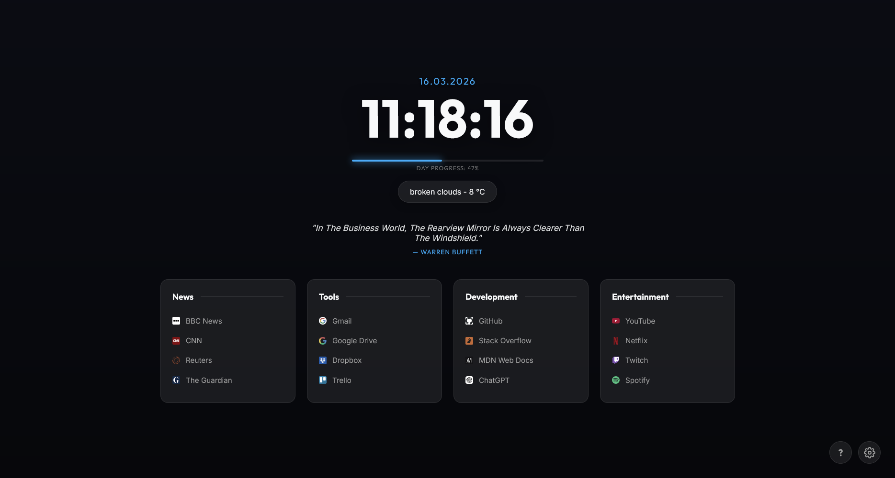
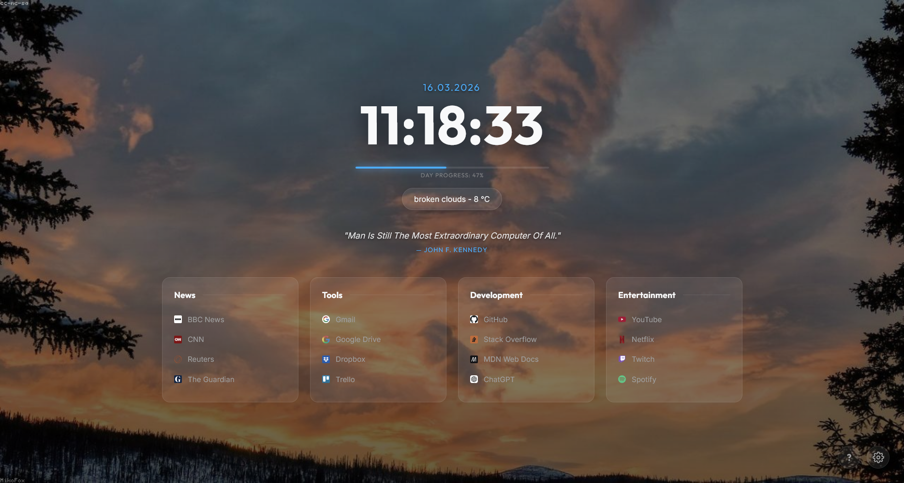

# QuickBoard

A modern, fast, and highly customizable personal dashboard. Built with **Vanilla JavaScript** and **Glassmorphism** design, QuickBoard transforms your browser's "New Tab" page into a beautiful and productive workspace.




## ✨ Features

-   **🕒 Smart Clock**: High-precision real-time clock with dynamic browser tab updates (shows time in the tab title).
-   **⚙️ Live Settings Panel**: Change your city, API keys, search engines, and themes directly from the UI without touching code.
-   **🖼️ Dynamic Backgrounds**: Automatically fetches beautiful nature and weather-specific backgrounds from LoremFlickr.
-   **🌡️ Dynamic Weather**: Real-time weather data via OpenWeatherMap API, synchronized with your background.
-   **📊 Day Progress Bar**: A minimal visual indicator showing how much of your day has passed.
-   **🔖 Bookmark Favicons**: Automatically fetches and displays icons for all your favorite sites.
-   **💬 Live Quotes**: Fresh motivational quotes fetched from a live API every time you open the page.
-   **🎨 Accent Color Picker**: Fully customize the look and feel by picking your own theme color.
-   **🚀 Premium Animations**: Smooth, staggered "page reveal" effects and interactive hover micro-animations.
-   **🔍 Multi-Engine Search**: Switch between Google, DuckDuckGo, Bing, and Searx with a single click.

## ⌨️ Keyboard Shortcuts

QuickBoard is designed for speed. Use these shortcuts anywhere:

-   <kbd>Space</kbd> : Open the Search Overlay
-   <kbd>S</kbd> : Open the Settings Panel
-   <kbd>H</kbd> : Toggle the Shortcuts Help Menu
-   <kbd>Esc</kbd> : Close all modals and overlays

## 🛠️ Getting Started

### 1. Installation
Simply download or clone the repository and open `index.html` in your browser.

### 2. Configuration (The Easy Way)
You no longer need to edit `script.js` to set up your board:
1.  Click the **Gear Icon** (⚙️) in the bottom right or press <kbd>S</kbd>.
2.  Enter your **City** and **OpenWeatherMap API Key**.
3.  Choose your preferred **Search Engine** and **Hour Format**.
4.  Pick an **Accent Color** that matches your style.
5.  Click **Apply & Save**. Your settings are saved locally!

### 3. Customizing Bookmarks
Open `bookmarks.js` to organize your favorite links:
```javascript
const bookmarks = [
  {
    title: "Work",
    links: [
      { name: "GitHub", url: "https://github.com" },
      { name: "Gmail", url: "https://gmail.com" }
    ]
  }
];
```

## 🏗️ Technical Highlights

-   **Zero Dependencies**: Written in 100% Vanilla JavaScript. No jQuery, no bloated libraries.
-   **Glassmorphism UI**: Uses modern CSS properties like `backdrop-filter` for a premium blurred-glass effect.
-   **Responsive Engine**: Built with CSS Grid and Flexbox for a perfect experience on Desktop, Tablet, and Mobile.
-   **Optimized Performance**: Staggered animations and smart DOM updates ensure a sub-second load time.
-   **Local Persistence**: All your preferences are stored safely in your browser's `localStorage`.

## 🔒 Privacy & Security

-   **No Tracking**: QuickBoard is a static project. It doesn't track you or collect any personal data.
-   **Local Only**: Your API keys and settings never leave your browser.
-   **HTTPS Ready**: All API calls (Weather, Quotes, Favicons) use secure HTTPS connections.

## 📝 Changelog

### v2.0 (Latest Overhaul)
-   **Removed jQuery**: Rewrote the entire project in optimized Vanilla JS for better performance.
-   **Settings UI**: Added a full settings modal to manage configuration without code edits.
-   **Accent Colors**: Implemented a dynamic theme engine with a color picker.
-   **Smart Backgrounds**: Switched to a more reliable image delivery system (LoremFlickr).
-   **Visual Polish**: Added staggered reveal animations and interactive hover effects.
-   **Utility Features**: Added Day Progress bar and Dynamic Tab titles.
-   **API Integration**: Switched to live API for motivational quotes.

---

**License**: This project is free and open-source. Feel free to fork and customize it!
**Credits**: Weather by [OpenWeatherMap](https://openweathermap.org), Imagery by [Unsplash/LoremFlickr](https://loremflickr.com).
